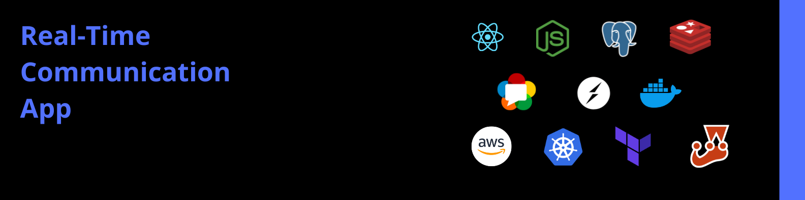

# Real-Time Communication Application

### A real-time applcation project to learn the tools from the system design until the lauching

## Summary
This is a project using the React with TypeScript, Express.js and Postgresql to learn from the different aspects of software development process. It shows how to do the following:

* Create an REST API with Express.js
* Use websockets
* Design the database
* Apply principles from clean archiecture
* Dockerize the app
* Implement caching (comming soon)
* Video and Audio communication (comming soon)
* Deployment in the cloud using terraform and kubernetes (comming soon)
* Testing
* Security, Authenticatio and Authorization

### Try it !
[Demo](https://gregarious-beijinho-ae0ab4.netlify.app/)
